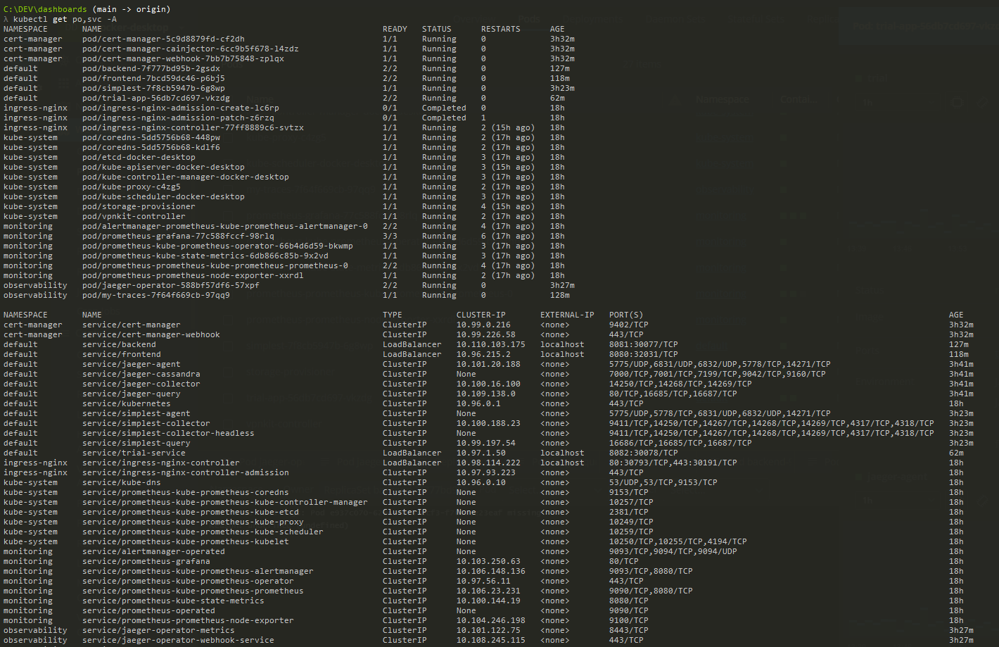
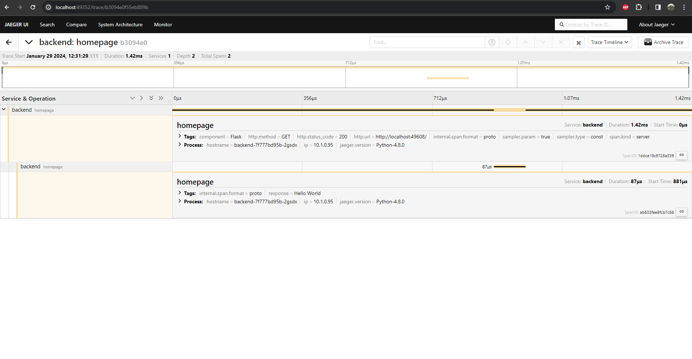

**Note:** For the screenshots, you can store all of your answer images in the `answer-img` directory.

## Verify the monitoring installation

*TODO:* run `kubectl` command to show the running pods and services for all components. Take a screenshot of the output and include it here to verify the installation

## Setup the Jaeger and Prometheus source
*TODO:* Expose Grafana to the internet and then setup Prometheus as a data source. Provide a screenshot of the home page after logging into Grafana.

## Create a Basic Dashboard
*TODO:* Create a dashboard in Grafana that shows Prometheus as a source. Take a screenshot and include it here.

## Describe SLO/SLI
*TODO:* Describe, in your own words, what the SLIs are, based on an SLO of *monthly uptime* and *request response time*.

SLI is a concrete metric, which value is used to show if we achieved the SLO.

For example: 

SLO is "monthly uptime", SLI is actual measurement of uptime, maybe we achieved uptime 99.5% or 97.3% during the month.

SLO is "request response time", SLI is actual measurement of the time it takes for the service to respond to a request, it may be 1.5 seconds.

## Creating SLI metrics.
*TODO:* It is important to know why we want to measure certain metrics for our customer. Describe in detail 5 metrics to measure these SLIs. 

Error rate measures the percentage of requests that result in errors throughout the customer experience.
 
Request latency measures how long it takes to return response to a request.
 
Availability measures the fraction of time that a service is available.
 
Throughput is number of requests that can be processed per unit of time.
 
Saturation is the percentage of resources being used. If the CPU/Memory usage is too high it may impact the UX.

## Create a Dashboard to measure our SLIs
*TODO:* Create a dashboard to measure the uptime of the frontend and backend services We will also want to measure to measure 40x and 50x errors. Create a dashboard that show these values over a 24 hour period and take a screenshot.

## Tracing our Flask App
*TODO:*  We will create a Jaeger span to measure the processes on the backend. Once you fill in the span, provide a screenshot of it here. Also provide a (screenshot) sample Python file containing a trace and span code used to perform Jaeger traces on the backend service.

## Jaeger in Dashboards
*TODO:* Now that the trace is running, let's add the metric to our current Grafana dashboard. Once this is completed, provide a screenshot of it here.

## Report Error
*TODO:* Using the template below, write a trouble ticket for the developers, to explain the errors that you are seeing (400, 500, latency) and to let them know the file that is causing the issue also include a screenshot of the tracer span to demonstrate how we can user a tracer to locate errors easily.

TROUBLE TICKET

Name: 404 Error Backend API

Date: 29.01.2024, 13:33:01

Subject: 404 Error Backend API 

Affected Area: Errror page

Severity: Medium

Description: We observed a new 404 Server Error in the backend, caused by a "errror" Post request.

## Creating SLIs and SLOs
*TODO:* We want to create an SLO guaranteeing that our application has a 99.95% uptime per month. Name four SLIs that you would use to measure the success of this SLO.

Latency: The response time of requests should less than 25ms within a month.
Failure rate: Ensure that the status code 2xx rates are around 98%.
Uptime: Uptime nedd to be approximate 99 percent within a month and response time should be around 500 milliseconds.
Saturation: average CPU usage should be less than 95% within a month.

## Building KPIs for our plan
*TODO*: Now that we have our SLIs and SLOs, create a list of 2-3 KPIs to accurately measure these metrics as well as a description of why those KPIs were chosen. We will make a dashboard for this, but first write them down here.

Latency: Response time was chosen as indicator, fast response ensures a great user experience.
Failure rate: Errors per second/response rate per second. Errors should be indicated and fixed in a fast manner to ensure the best user exeperience.
Uptime: Sucessful requests during pod uptime/successful request per second/request per second. Our system shouls be reliable for our users and do not have errors.
Saturation: CPU usage/ Memory usage. Our services shouls have enough resources to run smoothly and bring the best customer experience.

## Final Dashboard
*TODO*: Create a Dashboard containing graphs that capture all the metrics of your KPIs and adequately representing your SLIs and SLOs. Include a screenshot of the dashboard here, and write a text description of what graphs are represented in the dashboard.  

1. CPU Usage (for each container)

2. Memory Usage (for each container)

3. Uptime (for each container)

4. Average Response Time (Frontend+Backend)

5. Request duration (Frontend+Backend)

6. Count of response Types by status

8. Errors 50x and 40x
